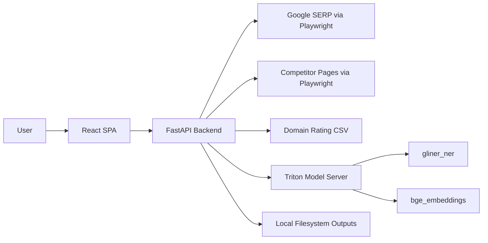
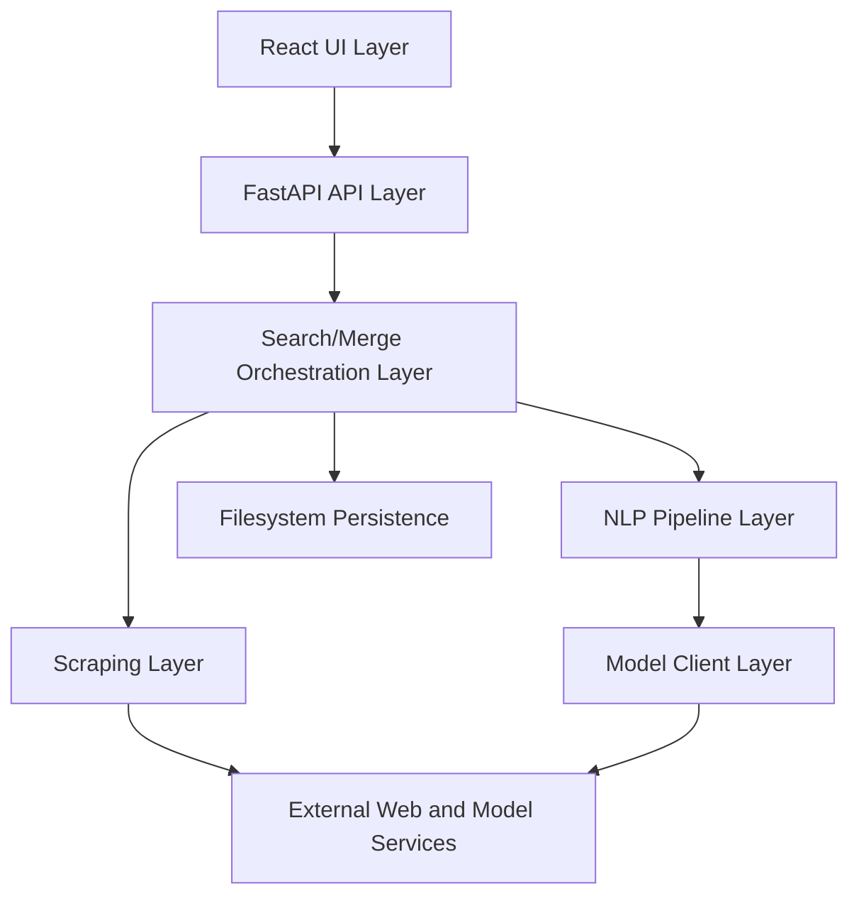
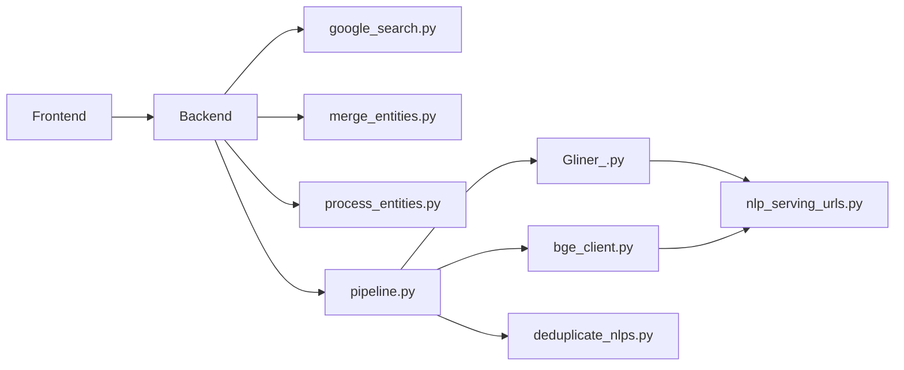
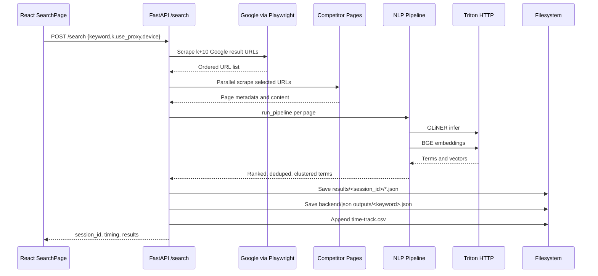
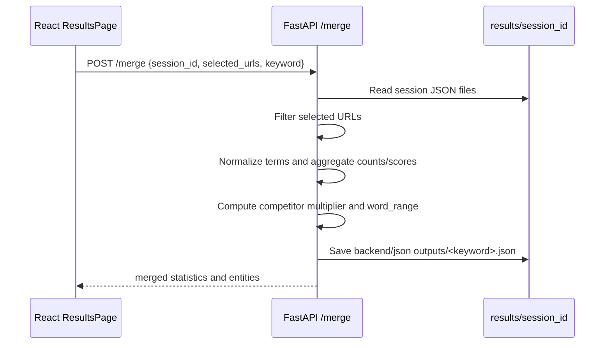
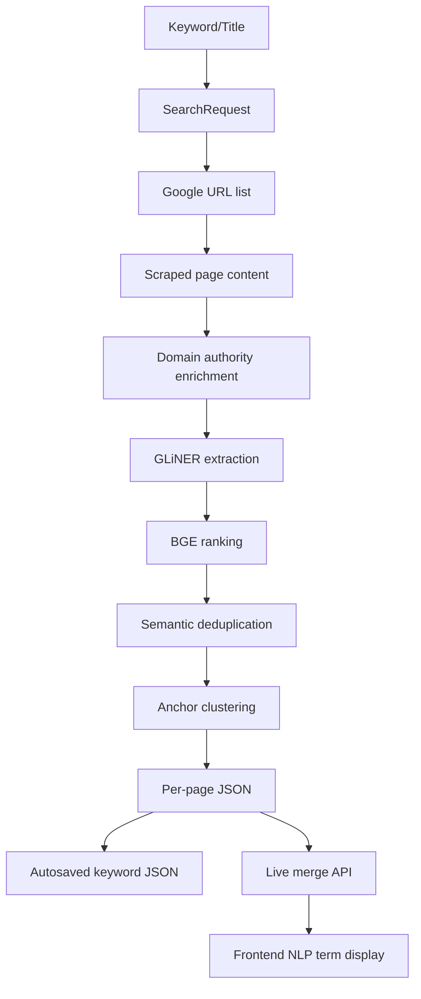
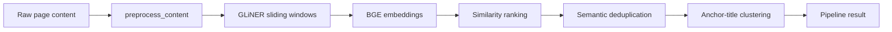
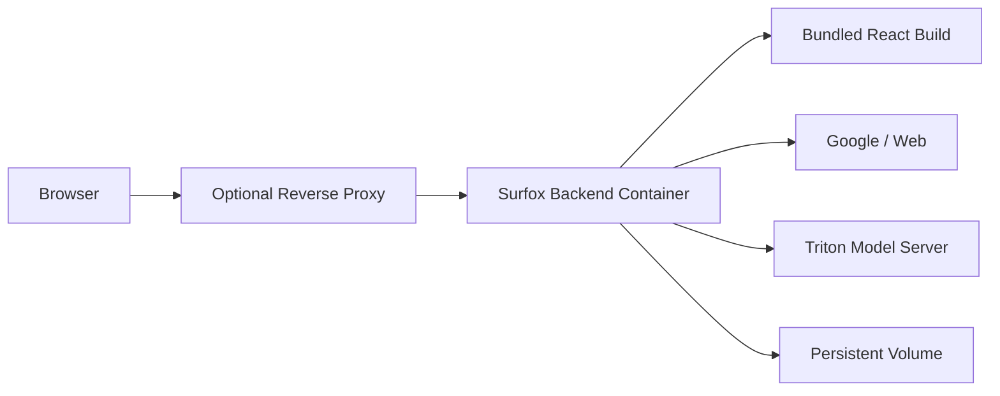

# Surfox Codebase Documentation

Last analyzed: 2026-05-13  
Repository root: `D:\Tahir\surfox-nlp`

## 1. Project Overview

### Purpose

Surfox is an NLP-powered SEO/content analysis application. It accepts a keyword or article title, collects Google search results, scrapes competitor pages, extracts important NLP terms from those pages, ranks and deduplicates those terms, and presents the results in a React dashboard.

The application is focused on competitor content analysis. Its primary output is a set of categorized NLP terms, saved both as API responses and as JSON files grouped into `Green`, `Orange`, and `White` buckets.

### Core Business Logic

At a high level, Surfox performs this workflow:

1. Receive one keyword/title or a batch of keywords/titles.
2. Scrape Google SERP URLs using Playwright.
3. Preserve Google result order and remove duplicate URLs.
4. Scrape each selected URL for page title, meta description, headings, and paragraph text.
5. Assign a domain authority score from `backend/Inputs/Data .csv`.
6. Run the scraped page content through the NLP pipeline.
7. Extract terms with GLiNER, rank them with BGE embeddings, deduplicate semantic duplicates, and cluster terms around the query/title.
8. Save per-result JSON files under `results/<session_id>/`.
9. Auto-save merged keyword output under `backend/json outputs/<keyword>.json`.
10. Let the frontend select competitor URLs and request a live merge.

### Main Features

| Area | Capability |
|---|---|
| Search | Single keyword/title search against Google |
| Batch search | Sequential processing of up to 50 keywords/titles |
| SERP scraping | Desktop/mobile Playwright fingerprints, optional proxy settings |
| Page scraping | Extracts title, description, headings, paragraphs, content text, word counts |
| NLP extraction | GLiNER-based term extraction through Triton HTTP |
| NLP ranking | BGE embedding similarity against page title/query |
| Deduplication | Semantic deduplication by cosine similarity |
| Clustering | Anchor-title relevance bucket plus secondary spherical k-means clusters |
| Merge analysis | Aggregates NLP terms across selected competitor domains |
| File outputs | Per-session result files, keyword JSON outputs, time tracking CSV |
| Frontend | React dashboard for search, results, live merged analysis |

### Technology Stack

| Layer | Technologies |
|---|---|
| Backend API | Python, FastAPI, Uvicorn, Pydantic |
| Browser automation | Playwright |
| HTML parsing | BeautifulSoup |
| NLP/ML | GLiNER, sentence-transformers, torch, flair, scikit-learn, numpy, nltk |
| Model serving integration | Triton HTTP/KServe v2 payloads for GLiNER and BGE |
| Frontend | React 18, React Router, Axios/fetch, react-toastify |
| Styling | CSS files under `frontend/src/styles`, global `App.css` |
| Containerization | Dockerfile based on Playwright Python image, docker-compose |
| Runtime config | `.env`, `.env.example`, frontend runtime `public/config.js` |

### High-Level Architecture Summary

Surfox is a two-tier web application with a separate model-serving dependency:



The backend behaves like a modular monolith. API routes, scraping, NLP orchestration, merge logic, local persistence, and static frontend serving all run in one FastAPI process. Heavy model inference is delegated to external Triton HTTP endpoints.

## 2. Architecture Documentation

### System Architecture

The repository contains:

| Part | Responsibility |
|---|---|
| `backend/main.py` | Main FastAPI app, search API, batch API, merge API, static frontend serving |
| `backend/google_search.py` | Google SERP scraping utilities, page scraping helpers, domain authority lookup |
| `backend/NLP_Extraction_and_Ranking/` | GLiNER extraction, BGE ranking, semantic deduplication, clustering, Triton clients |
| `frontend/src/` | React user interface |
| `Dockerfile` | Runtime image for backend plus prebuilt frontend |
| `docker-compose.yml` | Single backend container definition |
| `run_services.py` | Local helper to run backend and frontend together |

### Monolith vs Microservices

The application is not a full microservice architecture. It is best described as a modular monolith plus external model-serving services.

| Concern | Current Placement |
|---|---|
| HTTP API | Same FastAPI process |
| Search orchestration | Same FastAPI process |
| Page scraping | Same FastAPI process |
| Merge aggregation | Same FastAPI process |
| Result persistence | Same FastAPI process, local filesystem |
| Frontend static hosting | Same FastAPI process in production build mode |
| ML inference | External Triton endpoints, with legacy standalone FastAPI model servers present |

This design keeps development simple but creates operational coupling: a slow or failing search, scrape, model call, or filesystem write can impact the same backend process that serves API traffic.

### Layered Architecture Breakdown



| Layer | Files | Notes |
|---|---|---|
| UI | `frontend/src/App.js`, pages, components, styles | Handles form input, result display, selection-driven merge |
| API | `backend/main.py` | Defines request models and HTTP endpoints |
| Orchestration | `backend/main.py` | `_search_core` coordinates SERP, scraping, NLP, saving, timing |
| Scraping | `backend/google_search.py`, scraping helpers in `main.py` | Playwright-based browser automation and BeautifulSoup parsing |
| NLP pipeline | `backend/NLP_Extraction_and_Ranking/pipeline.py` | Preprocess, GLiNER extraction, BGE ranking, deduplication, clustering |
| Model clients | `Gliner_.py`, `bge_client.py`, `nlp_serving_urls.py` | Triton HTTP payload handling and connection pooling |
| Persistence | Local JSON files and CSV | No database is used |

### Design Patterns Used

| Pattern | Where | Why It Exists |
|---|---|---|
| Orchestrator function | `_search_core` in `backend/main.py` | Centralizes the end-to-end search pipeline shared by `/search` and `/batch_search` |
| Data transfer objects | Pydantic models in `main.py` | Request validation and API schema generation |
| Thin HTTP clients | `GLiNERClient`, `BGETritonClient` | Encapsulate Triton payload shape and connection reuse |
| Pipeline pattern | `run_pipeline` | Sequential NLP stages with timing and independent helper functions |
| Adapter compatibility | Legacy URL variables and standalone model servers | Keeps older model-serving paths available while current code uses Triton |
| Filesystem repository | `results/<session_id>/*.json` and `backend/json outputs/*.json` | Simple persistence without DB setup |
| Runtime frontend config | `frontend/public/config.js` plus `src/config.js` | Allows API URL override at runtime without rebuilding React |

### Dependency Flow



Important dependency observations:

| Dependency | Observation |
|---|---|
| `backend/main.py` imports many helpers directly | It is the most coupled module and the main integration point |
| `process_entities.py` is both script and helper module | `main.py` imports preprocessing/scoring helpers from a script-oriented file |
| `NLP_Extraction_and_Ranking/google_search.py` | **Deprecated** — production uses `backend/google_search.py` + `backend/serp_backends/` |
| Model server code exists in multiple forms | Current pipeline uses Triton clients, while legacy FastAPI model server scripts remain |

### Request Lifecycle

#### `/search`



#### `/merge`



### Service Communication Flow

| Source | Target | Protocol | Purpose |
|---|---|---|---|
| React frontend | FastAPI backend | HTTP JSON | Search, batch search, merge |
| Backend | Google | Playwright browser automation | SERP collection |
| Backend | Competitor URLs | Playwright browser automation | Content extraction |
| Backend | Triton GLiNER model | HTTP JSON KServe v2 | Named entity/NLP term extraction |
| Backend | Triton BGE model | HTTP JSON KServe v2 | Embedding generation |
| Legacy scripts | FastAPI model servers | HTTP JSON | Older GLiNER/BGE/CrossEncoder serving mode |

### Data Flow Diagram



## 3. Directory and File Structure

### Repository Structure

```text
surfox-nlp/
  backend/
    Inputs/
      Data .csv
    NLP_Extraction_and_Ranking/
      __init__.py
      bge_client.py
      deduplicate_nlps.py
      Gliner_.py
      google_search.py
      model_server.py
      nlp_serving_urls.py
      pipeline.py
      rank_entities.py
    google_search.py
    main.py
    merge_entities.py
    process_entities.py
    requirements.txt
    serve_models.py
    test_proximity.py
  frontend/
    public/
      config.js
      index.html
    src/
      components/
      pages/
      styles/
      App.js
      App.css
      config.js
      index.js
    package.json
    package-lock.json
    pnpm-lock.yaml
  Dockerfile
  docker-compose.yml
  generate_descriptions.py
  run_services.py
  time-track.csv
```

Generated or ignored directories currently referenced by code include `results/`, `backend/results/`, `backend/json outputs/`, `backend/google_serp_session/`, `frontend/build/`, and virtual environment folders.

### Major Folders

| Folder | Purpose |
|---|---|
| `backend/` | FastAPI backend, scraping logic, NLP scripts, model-serving helpers |
| `backend/Inputs/` | Domain Rating CSV used to compute authority scores |
| `backend/NLP_Extraction_and_Ranking/` | Current and legacy NLP extraction/ranking/deduplication modules |
| `frontend/` | React SPA |
| `frontend/src/pages/` | Route-level pages: search, results, merge |
| `frontend/src/components/` | Shared UI components |
| `frontend/src/styles/` | Page/component CSS |
| `frontend/public/` | Static HTML and runtime config loaded before React |

### Key Files and Responsibilities

| File | Responsibility |
|---|---|
| `backend/main.py` | Main application entry point and API implementation |
| `backend/google_search.py` | Google SERP scraping, URL normalization, authority lookup |
| `backend/NLP_Extraction_and_Ranking/pipeline.py` | Main in-memory NLP pipeline used by `main.py` |
| `backend/NLP_Extraction_and_Ranking/Gliner_.py` | Triton GLiNER client and sliding-window extraction |
| `backend/NLP_Extraction_and_Ranking/bge_client.py` | Triton BGE embedding client |
| `backend/NLP_Extraction_and_Ranking/deduplicate_nlps.py` | Deduplication and clustering helpers, also a legacy CLI script |
| `backend/NLP_Extraction_and_Ranking/nlp_serving_urls.py` | Triton and legacy model endpoint URL construction |
| `backend/merge_entities.py` | Text normalization and legacy CLI merge implementation |
| `backend/process_entities.py` | Legacy GLiNER local processing script; provides preprocessing/scoring helpers imported by `main.py` |
| `backend/serve_models.py` | Standalone combined GLiNER/SentenceTransformer FastAPI model server |
| `backend/NLP_Extraction_and_Ranking/model_server.py` | Legacy multi-process model server for ports 6000, 6005, 6010 |
| `frontend/src/App.js` | Router and top-level frontend state |
| `frontend/src/config.js` | Lazy runtime/build-time API config accessor |
| `frontend/src/pages/SearchPage.js` | Search and batch-search form |
| `frontend/src/pages/ResultsPage.js` | Result table and live merge display |
| `frontend/src/pages/MergePage.js` | Older/secondary merge display route |
| `run_services.py` | Local helper for running backend and frontend |
| `Dockerfile` | Production container build for backend plus frontend build output |
| `docker-compose.yml` | Single service container configuration |
| `generate_descriptions.py` | Standalone GPT-OSS batch description generation utility, separate from main app path |

### Entry Points

| Entry Point | Command | Purpose |
|---|---|---|
| Backend API | `python backend/main.py` from repo root or `python main.py` from `backend/` | Starts FastAPI with Uvicorn |
| Frontend dev server | `npm start` or `pnpm start` in `frontend/` | Starts React dev server |
| Combined local dev | `python run_services.py` | Starts backend and frontend together |
| Docker runtime | `docker compose up --build` | Starts backend container, expects built frontend copied during image build |
| Legacy model server | `python backend/NLP_Extraction_and_Ranking/model_server.py` | Starts GLiNER/BGE/CrossEncoder FastAPI services |
| Standalone model server | `python backend/serve_models.py` | Starts combined model API on one port |
| Legacy NLP processing | `python backend/process_entities.py <folder_path>` | Processes JSON files from a folder |
| Legacy merge CLI | `python backend/merge_entities.py` | Interactive merge of existing JSON files |

### Configuration Locations

| Location | Purpose |
|---|---|
| `.env` | Local runtime secrets/config; ignored by git |
| `.env.example` | Example configuration, currently includes proxy credential placeholders/values and should be sanitized |
| `frontend/public/config.js` | Runtime frontend API URL and endpoint paths |
| `frontend/src/config.js` | Config accessor with priority: `window.__APP_CONFIG__`, React env vars, fallback |
| `backend/NLP_Extraction_and_Ranking/nlp_serving_urls.py` | Model serving endpoint construction |
| `Dockerfile` | Container env defaults for `FRONTEND_DIR` and `PORT` |
| `docker-compose.yml` | Exposes backend container and loads `.env` |

## 4. Component and Module Documentation

### `backend/main.py`

Purpose: Main FastAPI backend and central orchestrator.

Responsibilities:

| Area | Details |
|---|---|
| App initialization | Loads `.env`, configures Windows event loop, sets logging, configures CORS |
| API models | Defines `SearchRequest`, `BatchSearchRequest`, `MergeRequest` |
| Health | `/health` endpoint |
| Search | `/search` endpoint and `_search_core` pipeline |
| Batch search | `/batch_search`, sequentially invokes `_search_core` |
| Merge | `/merge`, aggregates selected session files |
| Static serving | Serves built React app if `FRONTEND_DIR` exists |
| Tracking | Appends execution metrics to `time-track.csv` |

Important functions/classes:

| Name | Type | Responsibility |
|---|---|---|
| `SearchRequest` | Pydantic model | Single-search request body |
| `BatchSearchRequest` | Pydantic model | Batch-search request body |
| `MergeRequest` | Pydantic model | Merge request body |
| `lifespan` | Async context manager | Logs model-serving URLs at startup |
| `scrape_page_content` | Async function | Scrapes a competitor page with Playwright page object |
| `scrape_page_content_sync` | Function | Sync fallback for environments where async Playwright is unavailable |
| `_scrape_pages_sync` | Function | Sync fallback batch scraper |
| `_search_core` | Async function | Full end-to-end search orchestration |
| `search_and_process` | Endpoint | Calls `_search_core` for single searches |
| `batch_search_and_process` | Endpoint | Processes up to 50 keywords sequentially |
| `merge_entities` | Endpoint | Merges selected results from saved session JSON files |
| `append_time_track_row` | Function | Appends metrics to root `time-track.csv` |

Internal workflow of `_search_core`:

1. Create timestamp `session_id`.
2. Create `results/<session_id>/`.
3. Scrape Google for `k + 10` URLs.
4. Keep the top `k` URLs in SERP order after normalization-based de-duplication.
5. Scrape pages in parallel using a shared Playwright browser context.
6. For each scraped page, skip NLP when content is empty, too short, or has error-like title markers.
7. Run `run_pipeline` in a thread for eligible pages.
8. Convert pipeline entities into `nlp_terms`.
9. Save each result as numbered JSON.
10. Auto-merge all session terms into `backend/json outputs/<keyword>.json`.
11. Return timing and results.
12. Always append a timing row to `time-track.csv` in `finally`.

Public interface:

| Method | Path | Handler |
|---|---|---|
| GET | `/health` | `health_check` |
| POST | `/search` | `search_and_process` |
| POST | `/batch_search` | `batch_search_and_process` |
| POST | `/merge` | `merge_entities` |
| GET | `/` | `serve_frontend_root` |
| GET | `/{full_path:path}` | `serve_frontend_paths` |

Dependencies:

| Dependency | Usage |
|---|---|
| `google_search.py` | SERP scraping, fingerprinting, URL normalization, authority lookup |
| `process_entities.py` | Content preprocessing and legacy scoring helpers |
| `NLP_Extraction_and_Ranking.pipeline` | Current NLP pipeline |
| `merge_entities.py` | Entity normalization and display form selection |
| Playwright | Google and page scraping |
| BeautifulSoup | Extracting page text |
| Local filesystem | Session files, JSON outputs, tracking CSV |

Side effects:

| Side Effect | Location |
|---|---|
| Creates `results/<session_id>/` | Search |
| Writes numbered page JSON files | Search |
| Writes `backend/json outputs/<keyword>.json` | Search and merge |
| Appends `time-track.csv` | Search and batch search |
| Creates/updates Playwright persistent Google session | Google scraping helper |

Error handling strategy:

| Area | Strategy |
|---|---|
| Search endpoint | Catches broad exceptions, logs, returns HTTP 500 with detail |
| No URLs found | Raises HTTP 400 internally, but `/search` catches broad exception and wraps as HTTP 500 |
| Individual page scraping | Logs failure and skips failed page |
| Individual NLP page processing | Logs failure and skips failed page |
| Merge file read errors | Logs and continues |
| Timing CSV write failure | Logs but does not fail request |

Notable issue: the `/merge` endpoint ends with `except Exception:` and then references `e` in `str(e)`, but `e` is not bound in that block. A merge failure can therefore produce a secondary `NameError`/`UnboundLocalError` instead of the intended HTTP 500 detail.

### `backend/google_search.py`

Purpose: Google SERP and page scraping utilities.

Responsibilities:

| Area | Details |
|---|---|
| SERP scraping | Uses Playwright persistent context to collect organic URLs |
| URL cleaning | Removes fragments/tracking params and filters Google-owned hosts |
| Browser fingerprinting | Desktop/mobile user-agent and viewport profiles |
| Proxy support | Optional Oxylabs proxy configuration via environment variables |
| Domain authority | Loads `Inputs/Data .csv` and maps DR 0-100 to authority 0-10 |
| Standalone pipeline | Has an interactive `main_pipeline` for scraping pages outside API |

Important functions:

| Function | Responsibility |
|---|---|
| `load_dr_data` | Reads domain rating CSV |
| `normalize_url` | Removes tracking params and fragments |
| `is_organic_host` | Filters blocked Google hosts |
| `get_hardened_fingerprint` | Generates user-agent/viewport and navigator properties |
| `apply_stealth` | Adds browser scripts to hide automation indicators |
| `_scrape_google_results_async` | Main async SERP scraper |
| `_scrape_google_results_sync` | Sync fallback used by `backend/main.py` import |
| `get_authority` | Returns authority score from domain rating data |
| `scrape_page_content` | Standalone page content scraper |

Side effects:

| Side Effect | Details |
|---|---|
| Persistent browser profile | Uses `google_serp_session` |
| External web traffic | Opens Google and competitor pages |
| Console/log output | Logs SERP progress and scraping errors |

### `backend/NLP_Extraction_and_Ranking/pipeline.py`

Purpose: Current in-memory NLP pipeline used by the API.

Workflow:



Important functions:

| Function | Responsibility |
|---|---|
| `extract_nlps_gliner` | Calls `GLiNERClient` and sliding-window extractor |
| `rank_entities_in_memory` | Computes title/entity BGE cosine similarity and sorts terms |
| `deduplicate_in_memory` | Removes semantically similar duplicate terms above threshold |
| `cluster_with_anchor_title` | Builds anchor-title relevance cluster plus secondary clusters |
| `run_pipeline` | Orchestrates preprocessing, extraction, embedding, ranking, deduplication, clustering |


Dependencies:

| Dependency | Purpose |
|---|---|
| `process_entities.preprocess_content` | Reduces noise and text size before GLiNER |
| `Gliner_.GLiNERClient` | Calls Triton GLiNER model |
| `BGETritonClient` | Calls Triton BGE embeddings model |
| `deduplicate_nlps` helpers | Anchor seed construction and spherical k-means |
| `numpy` | Vector math |

Error handling:

| Failure | Behavior |
|---|---|
| Empty text | Returns empty entity list and zero timings |
| GLiNER returns no entities | Returns empty entity list |
| BGE pre-embedding failure | Logs exception and falls back to ranking step encoding |
| Ranking BGE failure | Returns unranked entities |
| Dedup BGE failure | Returns current ranked entities |

### `backend/NLP_Extraction_and_Ranking/Gliner_.py`

Purpose: Triton GLiNER client and extraction post-processing.

Responsibilities:

| Area | Details |
|---|---|
| Triton payload creation | Sends `text`, `labels`, and `threshold` inputs to KServe v2 infer endpoint |
| Connection reuse | Class-level `requests.Session` with configurable pool size |
| Batch inference | Supports batch requests for multiple chunks |
| Sliding-window chunking | Splits long text into word-boundary windows |
| Entity cleanup | Removes pronouns, tiny tokens, and known word fragments |
| Aggregation | Case-insensitive counts with canonical display form |

Important configuration:

| Env Var | Default | Meaning |
|---|---:|---|
| `GLINER_REQUEST_CONCURRENCY` | `64` | HTTP connection pool size |
| `GLINER_CHUNK_BATCH_SIZE` | `8` | Chunks per Triton request |
| `GLINER_PARALLEL_BATCH_REQUESTS` | `8` | Parallel batch requests |

Public classes/functions:

| Name | Type | Purpose |
|---|---|---|
| `GLiNERClient` | Class | HTTP client for `gliner_ner` Triton model |
| `predict_entities` | Method | Single text inference |
| `predict_entities_batch` | Method | Batch text inference |
| `extract_entities_sliding_window` | Function | Chunk, infer, filter, aggregate |

### `backend/NLP_Extraction_and_Ranking/bge_client.py`

Purpose: Triton BGE embedding client.

Responsibilities:

| Area | Details |
|---|---|
| Batching | Splits text list by `BGE_MAX_BATCH_SIZE` |
| Parallel calls | Uses `ThreadPoolExecutor` for concurrent Triton calls |
| Payload format | Sends `text` and `is_query` inputs |
| Response parsing | Reads `embeddings` output and reshapes into numpy array |

Important configuration:

| Env Var | Default | Meaning |
|---|---:|---|
| `BGE_REQUEST_CONCURRENCY` | `64` | HTTP connection pool size |
| `BGE_MAX_BATCH_SIZE` | `64` | Texts per infer request |
| `BGE_PARALLEL_INFER_REQUESTS` | `8` | Parallel Triton calls |

Public interface:

```python
BGETritonClient().encode(texts: list[str], is_query: bool = False) -> numpy.ndarray
```

### `backend/NLP_Extraction_and_Ranking/deduplicate_nlps.py`

Purpose: Deduplication and clustering algorithms, plus legacy CLI wrapper.

Important reusable helpers:

| Function | Purpose |
|---|---|
| `_l2_normalize` | Normalizes embedding rows |
| `_build_anchor_seed_texts` | Converts a title into full-title and chunk seed phrases |
| `_spherical_kmeans` | Cosine/spherical k-means implementation |

Legacy script behavior:

1. Reads ranked entities JSON.
2. Iteratively removes near-duplicates by BGE cosine similarity.
3. Clusters remaining terms around a hard-coded anchor title.
4. Saves full JSON, clusters-only JSON, CSV, and `final_result.json`.

The API path uses helper functions from this file but does not use the CLI `deduplicate_nlps` workflow directly.

### `backend/NLP_Extraction_and_Ranking/nlp_serving_urls.py`

Purpose: Central model endpoint configuration.

Current primary mode:

| Variable | Default |
|---|---|
| `TRITON_HTTP_URL` | `http://localhost:8010` |
| `TRITON_GLINER_MODEL_NAME` | `gliner_ner` |
| `TRITON_BGE_MODEL_NAME` | `bge_embeddings` |
| `TRITON_GLINER_INFER_URL` | `<TRITON_HTTP_URL>/v2/models/<model>/infer` |
| `TRITON_BGE_INFER_URL` | `<TRITON_HTTP_URL>/v2/models/<model>/infer` |

Legacy compatibility:

| Variable | Default |
|---|---|
| `GLINER_API_URL` | `http://localhost:6000` |
| `BIENCODER_API_URL` | `http://localhost:6005` |
| `CROSSENCODER_API_URL` | `http://localhost:6010` |

### `backend/merge_entities.py`

Purpose: Entity text normalization and legacy interactive merge script.

Reusable functions imported by `main.py`:

| Function | Purpose |
|---|---|
| `singularize_word` | Converts common plural words to singular |
| `normalize_entity_text` | Lowercases and singularizes final word for grouping |
| `get_best_display_form` | Picks most frequent/longer display form |

The file also contains a CLI flow for scanning JSON files, prompting user selection, aggregating entities, and writing `merged_output/merged_entities_<timestamp>.json`.

### `backend/process_entities.py`

Purpose: Legacy local GLiNER processing script and helper functions.

Current API dependency:

| Function | Used By | Purpose |
|---|---|---|
| `preprocess_content` | `main.py`, `pipeline.py` | Removes stopwords, pronouns, short tokens |
| `calculate_tfidf_scores` | Imported in `main.py` | Legacy scoring; not central to current `/search` flow |
| `calculate_weightage` | Imported in `main.py` | Legacy score composition; not central to current `/search` flow |

Legacy script responsibilities:

1. Load GLiNER locally.
2. Process JSON files in a folder.
3. Extract entities.
4. Compute relevance, TF-IDF, and weightage.
5. Save output JSON files.

Important risk: this script hard-codes `cuda:1` in several places, so it is not portable to CPU-only machines or single-GPU machines without editing.

### `backend/serve_models.py`

Purpose: Standalone FastAPI model server for GLiNER and SentenceTransformer.

Endpoints:

| Method | Path | Purpose |
|---|---|---|
| POST | `/extract_entities` | GLiNER inference |
| POST | `/similarity` | SentenceTransformer cosine similarity |
| GET | `/health` | Model readiness |

This server is not wired into the current `main.py` pipeline, which uses Triton clients instead.

### `backend/NLP_Extraction_and_Ranking/model_server.py`

Purpose: Legacy multi-process FastAPI model server.

Processes:

| Process | Port | Model |
|---|---:|---|
| GLiNER | `6000` | `urchade/gliner_large-v2.1` |
| BiEncoder | `6005` | `BAAI/bge-large-en-v1.5` |
| CrossEncoder | `6010` | `BAAI/bge-reranker-base` |

This file is useful historical context but is not the current primary path because `Gliner_.py` and `bge_client.py` target Triton.

### Frontend Modules

#### `frontend/src/App.js`

Purpose: Top-level React router and shared search state.

Responsibilities:

| Responsibility | Details |
|---|---|
| Routing | `/`, `/results`, `/merge` |
| Shared state | Stores `sessionId` and `searchResults` |
| Toasts | Configures `ToastContainer` |
| Layout | Renders `Header` and current route |

#### `frontend/src/config.js`

Purpose: Lazy frontend configuration.

Priority order:

1. `window.__APP_CONFIG__` loaded from `public/config.js`.
2. Build-time `REACT_APP_*` environment variables.
3. Hard-coded fallback `http://localhost:8011`.

This makes production runtime overrides possible, but it creates a risk when backend and frontend defaults drift.

#### `frontend/src/pages/SearchPage.js`

Purpose: Search and batch-search form.

Responsibilities:

| Responsibility | Details |
|---|---|
| Single search | Sends `keyword`, `k`, `device`, proxy/browser flags |
| Batch search | Accepts JSON array or newline-separated keywords |
| Input validation | Requires keyword or at least two batch items |
| Progress UX | Simulated progress bar and elapsed timer |
| Navigation | Routes to `/results` after successful search |
| Error UX | Toasts backend reachability/API errors |

Important behavior: `use_browser` affects the request body, but the backend forces `effective_headless = True`, so visible browser mode is not honored by the API search path.

#### `frontend/src/pages/ResultsPage.js`

Purpose: Displays search results and performs live merge as user selects URLs.

Responsibilities:

| Responsibility | Details |
|---|---|
| Result table | Displays rank, domain, title, word count, authority |
| Selection | Checkbox selection by URL |
| Live merge | Calls `/merge` whenever `selectedUrls` changes |
| Entity display | Splits terms into green, orange, and white groups based on score ranking |
| Tooltips | Shows score, count, competitor count, source domains |

Potential issue: when page state is lost on browser refresh, `results` prop may be empty and the page cannot reconstruct from `session_id`.

#### `frontend/src/pages/MergePage.js`

Purpose: Older route for displaying completed merge data passed through router state.

It is less central than `ResultsPage`, because the current UI performs live merge directly on the results page.

#### `frontend/src/components/Header.js`

Simple header with application name and home link.

#### `frontend/src/components/ProgressBar.js`

Reusable progress bar component, though `SearchPage` currently renders its own progress markup instead of this component.

## 5. API Documentation

Base URL depends on environment:

| Context | Observed URL |
|---|---|
| Backend default without env | `http://localhost:8011` |
| `.env.example`/Docker/run script intent | `http://localhost:8010` |
| Frontend fallback/runtime config | `http://localhost:8011` |

The port configuration should be normalized before production use.

### Authentication

No API authentication exists in the current code. CORS allows all origins.

### Middleware

| Middleware | Configuration |
|---|---|
| `CORSMiddleware` | `allow_origins=["*"]`, `allow_credentials=True`, `allow_methods=["*"]`, `allow_headers=["*"]` |

### Endpoints

#### `GET /health`

Purpose: Backend health check and model endpoint visibility.

Response example:

```json
{
  "status": "ok",
  "message": "Surfox backend is running (NLP: GLiNER=http://localhost:6000, ranker=http://localhost:6005)"
}
```

Note: the message displays legacy model URLs even though current GLiNER/BGE clients use Triton URLs internally.

#### `POST /search`

Purpose: Run a single search/scrape/NLP pipeline.

Request body:

```json
{
  "keyword": "best dog breeds for families",
  "k": 10,
  "use_proxy": true,
  "headless": true,
  "use_browser": false,
  "device": "desktop"
}
```

Request fields:

| Field | Type | Default | Notes |
|---|---|---:|---|
| `keyword` | string | required | Search keyword/title |
| `k` | integer | `20` | Backend does not enforce frontend min/max through Pydantic constraints |
| `use_proxy` | boolean | `false` | Passed to Google SERP scraper |
| `headless` | boolean | `true` | Accepted but backend forces headless execution |
| `use_browser` | boolean | `false` | Recorded in tracking only; backend forces headless |
| `device` | string | `desktop` | Expected `desktop` or `mobile` |

Response shape:

```json
{
  "session_id": "20260513_143000",
  "keyword": "best dog breeds for families",
  "total_results": 10,
  "timing": {
    "google_search_time_seconds": 12.34,
    "content_scraping_time_seconds": 24.56,
    "nlp_total_time_seconds": 35.67,
    "nlp_step_times_seconds": {
      "preprocess": 0.12,
      "gliner": 20.0,
      "ranking": 8.0,
      "deduplication": 1.0,
      "clustering": 0.5
    },
    "save_results_time_seconds": 0.03,
    "autosave_json_time_seconds": 0.04,
    "avg_page_scrape_time_seconds": 2.5,
    "avg_page_nlp_time_seconds": 3.8,
    "total_time_seconds": 72.0
  },
  "results": [
    {
      "rank": 1,
      "url": "https://example.com/page",
      "domain": "example.com",
      "title": "Example Page",
      "description": "Example meta description",
      "word_count": 1200,
      "heading_count": 8,
      "para_count": 20,
      "authority": 7,
      "entities": [],
      "total_entities": 0,
      "keyphrases": [],
      "gpt_terms": [],
      "nlp_terms": [
        {
          "text": "best dog breeds for families",
          "count": 1,
          "relevance": 1.0,
          "weightage": 1.0,
          "source": "gliner",
          "label": "NLP"
        }
      ],
      "total_nlp_terms": 50,
      "ranking_method": "biencoder",
      "nlp_clusters": {},
      "nlp_cluster_scores": {},
      "content_preview": "First 500 characters..."
    }
  ]
}
```

Error responses:

| Scenario | Intended Status | Current Behavior |
|---|---:|---|
| No URLs found | 400 | Raised inside `_search_core`, then generally wrapped by endpoint as 500 |
| Scrape/model failure | 500 | Broad exception detail returned |
| Individual page failure | Not request-fatal | Page skipped |

#### `POST /batch_search`

Purpose: Run multiple searches sequentially and auto-save JSON for each keyword.

Request body:

```json
{
  "keywords": ["Title 1", "Title 2"],
  "k": 10,
  "use_proxy": true,
  "headless": true,
  "use_browser": false,
  "device": "desktop"
}
```

Validation:

| Rule | Behavior |
|---|---|
| Empty/blank keyword list | HTTP 400 |
| More than 50 keywords | Truncated to first 50 |
| Per-keyword failure | Captured in item-level `error`, batch continues |

Response shape:

```json
{
  "total_keywords": 2,
  "completed": 1,
  "failed": 1,
  "elapsed_seconds": 120.5,
  "items": [
    {
      "keyword": "Title 1",
      "session_id": "20260513_143000",
      "total_results": 10,
      "timing": {}
    },
    {
      "keyword": "Title 2",
      "error": "..."
    }
  ]
}
```

#### `POST /merge`

Purpose: Merge saved NLP terms from selected URLs in a session.

Request body:

```json
{
  "selected_urls": [
    "https://example.com/page"
  ],
  "session_id": "20260513_143000",
  "keyword": "best dog breeds for families"
}
```

Response shape:

```json
{
  "merge_date": "2026-05-13T14:30:00.000000",
  "ranking_method": "biencoder",
  "total_files_processed": 3,
  "average_statistics": {
    "avg_word_count": 900.0,
    "avg_heading_count": 8.0,
    "avg_paragraph_count": 20.0,
    "avg_images_count": 0.0,
    "word_range_60_percent_value": 540.0,
    "total_adjusted_weightage": 22.4
  },
  "total_unique_entities": 100,
  "total_entity_occurrences": 250,
  "entities": [
    {
      "text": "Family Dog",
      "label": "NLP",
      "combined_count": 5,
      "sources": ["gliner"],
      "source_counts": {"gliner": 5},
      "average_relevance": 0.71,
      "average_weightage": 0.71,
      "average_keybert_score": 0.0,
      "competitor_count": 2,
      "found_in_files": ["example.com", "another.com"],
      "competitor_multiplier": 2,
      "adjusted_weightage": 1.42,
      "word_range": 12
    }
  ]
}
```

Side effects:

| Side Effect | Details |
|---|---|
| Reads | `results/<session_id>/*.json` relative to backend working directory |
| Writes | `backend/json outputs/<keyword>.json` |
| Bucket logic | Green = top 40%, White = top 10% of remaining, Orange = rest |

#### Static Frontend Routes

| Method | Path | Behavior |
|---|---|---|
| GET | `/` | Serves `FRONTEND_DIR/index.html` if it exists |
| GET | `/{full_path:path}` | Serves static file if present, otherwise SPA fallback to `index.html` |

### Rate Limiting and API Versioning

No rate limiting is implemented. No API versioning is implemented.

## 6. Database Documentation

### Database Type

No database is used in the current codebase.

### Persistence Model

Surfox uses the local filesystem as persistence:

| Data | Location | Writer |
|---|---|---|
| Per-search page results | `results/<session_id>/<n>.json` | `_search_core` |
| Keyword bucket outputs | `backend/json outputs/<keyword>.json` | `_search_core`, `/merge` |
| Time tracking metrics | `time-track.csv` | `_search_core` finally block |
| Domain rating reference data | `backend/Inputs/Data .csv` | Static input file |
| Google browser profile/session | `google_serp_session` | Playwright persistent context |

### Schema Overview

There is no relational schema. JSON result files are the closest equivalent to persisted entities.

Per-page result fields include:

| Field | Meaning |
|---|---|
| `rank` | SERP rank |
| `url` | Source page URL |
| `domain` | Parsed domain |
| `title` | HTML title |
| `description` | Meta description |
| `word_count` | Word count from extracted content |
| `heading_count` | Count of heading tags |
| `para_count` | Count of paragraphs |
| `authority` | Domain authority score 0-10 |
| `nlp_terms` | Ranked terms for the page |
| `nlp_clusters` | Cluster mapping from pipeline |
| `nlp_cluster_scores` | Cluster similarity scores |
| `content_preview` | First 500 characters of content |

### Relationships

Implicit relationships:

| Parent | Child | Link |
|---|---|---|
| Search session | Result JSON files | Directory name `session_id` |
| Result JSON | Source URL | `url` field |
| Merge request | Result JSON files | `session_id` plus `selected_urls` |
| Domain authority | Page domain | Domain string lookup in CSV |

### Migrations and ORM

No migrations or ORM are present.

### Indexing Strategy

No indexes are present. Merge scans all JSON files in a session directory and filters by URL in memory.

### Data Lifecycle

| Data | Lifecycle |
|---|---|
| Session result files | Created for every search; no retention/cleanup implemented |
| Keyword JSON outputs | Overwritten when the same safe keyword filename is generated again |
| `time-track.csv` | Append-only; no rotation implemented |
| Google session profile | Reused across scraping runs |

### Transaction Handling

No transaction system exists. Writes are independent file writes. Partial search outputs can exist if a request fails after creating a session directory or writing some files.

## 7. Authentication and Security

### Authentication Flow

No authentication or authorization is implemented.

### Session/JWT Handling

No user sessions, JWTs, cookies, or login flow exist. `session_id` is a search artifact, not an authenticated session.

### Role Permissions

No role or permission model exists.

### Middleware Security

Current CORS configuration allows all origins and credentials:

```python
allow_origins=["*"]
allow_credentials=True
allow_methods=["*"]
allow_headers=["*"]
```

This is permissive and should be tightened for production.

### Encryption Methods

No encryption logic exists in the application code. TLS termination, if any, is expected to be handled outside the app.

### Secrets Management

Configuration is loaded through `.env` using `python-dotenv`. `.env` is ignored by git.

Security concern: `.env.example` currently contains proxy credential-looking values. Even if these are test credentials, example files should not include real usernames/passwords. Replace with placeholders before sharing.

### Vulnerability Concerns

| Risk | Details | Priority |
|---|---|---:|
| No authentication | Anyone who can reach the API can trigger searches, scraping, model inference, and file writes | High |
| Open CORS | Browser clients from any origin can call the API | High |
| Expensive unauthenticated operations | `/search` can consume browser, network, GPU/model, and filesystem resources | High |
| Secrets in example config | Proxy credentials appear in `.env.example` | High |
| Unbounded local persistence | Result files and CSV grow indefinitely | Medium |
| Broad exception details | API may return internal exception strings | Medium |
| SSRF-like behavior | Backend fetches URLs returned by Google; not arbitrary user URLs, but still external navigation from server | Medium |
| Scraping compliance | Google scraping and competitor page scraping may violate service terms depending on use | Medium |
| Port/config mismatch | Frontend/backend/model defaults overlap and drift | Medium |

### Security Best Practices Present

| Practice | Where |
|---|---|
| `.env` ignored | `.gitignore`, `.dockerignore` |
| Static file path constrained to `FRONTEND_DIR` | `serve_frontend_paths` |
| Basic URL normalization/filtering for Google hosts | `google_search.py` |
| Playwright sandbox arg in SERP context | `--no-sandbox` is present, though this is operationally risky in some environments |

## 8. Configuration and Environment

### Environment Variables

Observed variables:

| Variable | Default/Example | Used By | Purpose |
|---|---|---|---|
| `BACKEND_HOST` | `0.0.0.0` | `.env.example` | Documented but not used directly in `main.py` |
| `BACKEND_PORT` | `8010` example, `8011` code fallback | `main.py` | Backend port |
| `PORT` | `8010` Docker | `main.py`, Docker | Fallback backend port |
| `FRONTEND_PORT` | `3010` | `run_services.py` concept | Frontend dev port |
| `FRONTEND_DIR` | `frontend/build` or `/app/frontend/build` | `main.py`, Docker | Static frontend location |
| `REACT_APP_API_URL` | example URL | React build | Build-time frontend API base |
| `REACT_APP_SEARCH_ENDPOINT` | `/search` | React config | Search path |
| `REACT_APP_BATCH_SEARCH_ENDPOINT` | `/batch_search` fallback | React config | Batch path |
| `REACT_APP_MERGE_ENDPOINT` | `/merge` | React config | Merge path |
| `GOOGLE_URL` | `https://www.google.com/search` | `google_search.py` | Search URL |
| `GOOGLE_PROXY_URL` | proxy URL | `google_search.py` | Legacy proxy URL |
| `OXYLABS_PROXY_SERVER` | proxy server | `google_search.py` | Playwright proxy server |
| `OXYLABS_PROXY_USERNAME` | secret | `google_search.py` | Proxy username |
| `OXYLABS_PROXY_PASSWORD` | secret | `google_search.py` | Proxy password |
| `USE_PROXY` | `false` | `.env.example` | Not directly used by current request models |
| `HEADLESS_MODE` | `true` | `.env.example` | Not directly used by `_search_core` |
| `DEFAULT_DEVICE` | `desktop` | `.env.example` | Not directly used by `_search_core` |
| `DR_CSV_PATH` | `../Inputs/Data .csv` | `.env.example` | Not used by current `load_dr_data` default |
| `UPLOADS_DIR` | `uploads` | `.env.example` | Not observed in code path |
| `RESULTS_DIR` | `results` | `main.py` | Session output directory |
| `CUDA_VISIBLE_DEVICES` | `0` | Environment | GPU selection |
| `USE_GPU` | `true` | `.env.example` | Not directly used |
| `GLINER_MODEL` | model id | `.env.example` | Not used by current Triton client |
| `SENTENCE_TRANSFORMER_MODEL` | model id | `.env.example` | Not used by current Triton client |
| `URL_PROCESSING_BATCH_SIZE` | `8` | `main.py` | NLP page batch size |
| `MAX_PAGE_NLP_TERMS` | `100` | `main.py` | Max terms per page |
| `MAX_FINAL_NLP_TERMS` | `300` | `main.py` | Defined but not clearly enforced in merge |
| `NLP_PER_ARTICLE_KEEP_RATIO` | `0.80` | `main.py` | Merge keeps strongest portion per article |
| `GLINER_CONTEXT_SIZE` | `600` | `main.py` | Chunk size |
| `GLINER_STEP_SIZE` | `400` | `main.py` | Chunk step |
| `SCRAPE_CONCURRENCY` | `6` | `main.py` | Parallel page scraping |
| `NLP_MIN_WORDS` | `30` | `main.py` | Minimum content words for NLP |
| `NLP_THIN_CONTENT_WORDS` | `80` | `main.py` | Thin page threshold |
| `NLP_LOW_QUALITY_MAX_NLPS` | `60` | `main.py` | Thin page NLP cap |
| `NLP_MEDIUM_QUALITY_MAX_NLPS` | `80` | `main.py` | Medium page NLP cap |
| `NLP_ERROR_TITLE_MARKERS` | comma list | `main.py` | Skip pages with error-like titles |
| `MAX_NLP_INPUT_CHARS` | `18000` | `pipeline.py` | Caps text length |
| `TRITON_HTTP_URL` | `http://localhost:8010` | `nlp_serving_urls.py` | Triton base URL |
| `SURF_NLP_MODELS_HOST` | `localhost` | `nlp_serving_urls.py` | Model host fallback |
| `TRITON_HTTP_PORT` | `8010` | `nlp_serving_urls.py` | Triton port fallback |
| `TRITON_GLINER_MODEL_NAME` | `gliner_ner` | `nlp_serving_urls.py` | Triton GLiNER model |
| `TRITON_BGE_MODEL_NAME` | `bge_embeddings` | `nlp_serving_urls.py` | Triton BGE model |
| `SURF_GLINER_API_URL` | none | `nlp_serving_urls.py` | Legacy URL override |
| `SURF_BIENCODER_API_URL` | none | `nlp_serving_urls.py` | Legacy URL override |
| `SURF_CROSSENCODER_API_URL` | none | `nlp_serving_urls.py` | Legacy URL override |
| `BGE_REQUEST_CONCURRENCY` | `64` | `bge_client.py` | HTTP pool size |
| `BGE_MAX_BATCH_SIZE` | `64` | `bge_client.py` | BGE batch size |
| `BGE_PARALLEL_INFER_REQUESTS` | `8` | `bge_client.py` | BGE parallel calls |
| `GLINER_REQUEST_CONCURRENCY` | `64` | `Gliner_.py` | HTTP pool size |
| `GLINER_CHUNK_BATCH_SIZE` | `8` | `Gliner_.py` | GLiNER batch size |
| `GLINER_PARALLEL_BATCH_REQUESTS` | `8` | `Gliner_.py` | GLiNER parallel calls |


## 9. Development Workflow

### Local Setup

Backend:

```bash
cd backend
python -m venv .venv
.venv\Scripts\activate
pip install -r requirements.txt
playwright install chromium
python main.py
```

Frontend:

```bash
cd frontend
npm install
npm start
```

Combined helper:

```bash
python run_services.py
```

Important: verify backend port alignment before using `run_services.py`. The helper prints backend port `8010`, while `main.py` falls back to `8011` unless `BACKEND_PORT` or `PORT` is set by `.env` or environment.

### Model Services

The current pipeline expects Triton endpoints:

| Model | Default URL |
|---|---|
| GLiNER | `http://localhost:8010/v2/models/gliner_ner/infer` |
| BGE | `http://localhost:8010/v2/models/bge_embeddings/infer` |

Legacy alternatives exist, but are not the primary API path:

```bash
cd backend/NLP_Extraction_and_Ranking
python model_server.py
```

### Running the App

Development:

1. Start Triton/model service.
2. Start backend.
3. Start frontend.
4. Open frontend dev URL.

Docker:

1. Build frontend first.
2. Build and run Docker Compose.

```bash
cd frontend
npm run build
cd ..
docker compose up --build
```


## 10. Dependency Analysis

### Backend Dependencies

| Dependency | Purpose | Risk/Notes |
|---|---|---|
| `fastapi`, `uvicorn`, `pydantic` | API server and validation | Core runtime |
| `python-multipart` | Form upload support | No upload endpoint observed |
| `aiohttp`, `requests` | HTTP clients | Both async and sync clients used |
| `beautifulsoup4` | HTML parsing | Core scraping dependency |
| `playwright` | Browser automation | Heavy dependency; requires browser install |
| `langdetect` | Language detection | Present in scraper helpers; not central in API flow |
| `numpy`, `scikit-learn` | Vector/math utilities | Core NLP pipeline |
| `gliner`, `sentence-transformers`, `torch`, `flair` | Local/legacy model inference | Heavy dependencies; not all needed if only Triton clients are used |
| `huggingface_hub` | Model downloads/transitive support | Version constrained |
| `nltk` | Stopword preprocessing | Downloads stopwords if missing |
| `python-dotenv` | `.env` loading | Core config |
| `cors` | Listed dependency | Not directly used; FastAPI CORS middleware comes from Starlette |
| `keybert` | Legacy keyphrase extraction | Current pipeline appears GLiNER/BGE-based |

### Frontend Dependencies

| Dependency | Purpose | Risk/Notes |
|---|---|---|
| `react`, `react-dom` | UI framework | Core |
| `react-router-dom` | Routing | Core |
| `axios` | Search request HTTP client | Merge uses native `fetch`, so HTTP usage is inconsistent |
| `react-toastify` | Toast notifications | Core UX |
| `lucide-react` | Icons | Present but not observed in current components |
| `tailwindcss` | Utility CSS framework | Present but app uses regular CSS files; Tailwind config not observed |
| `react-scripts` | CRA build/test tooling | Heavy and aging; consider Vite for future |
| `serve` | Static serving utility | Dev/prod helper, not central to Docker path |

### Heavy Dependencies

| Dependency | Why Heavy |
|---|---|
| Playwright base image | Browser runtime and dependencies |
| Torch/Flair/SentenceTransformers/GLiNER | ML stack with large binary/model footprint |
| React Scripts | Large frontend build chain |

### Upgrade Considerations

| Area | Consideration |
|---|---|
| FastAPI/Pydantic | Current versions are from late 2023; test Pydantic behavior before upgrading |
| Playwright | Browser automation can break with Google DOM changes; keep pinned but update intentionally |
| GLiNER/sentence-transformers | Model APIs can change; current legacy scripts depend on specific methods |
| React Scripts | Consider migration path due to aging CRA ecosystem |
| Torch/CUDA | Align with deployment GPU drivers and model-serving environment |


## 11. Observability

### Logging

Logging uses Python `logging.basicConfig` in `main.py` and `google_search.py`.

Observed log coverage:

| Area | Logged |
|---|---|
| Backend startup | Model URLs |
| Google scraping | Query, fetched URLs, count found |
| Page scraping | URL index and failures |
| NLP pipeline | Step start/end and timings |
| Merge | Selected count, output summary |
| File saving | Errors and autosave summaries |
| Timing | CSV append status |

### Metrics

No metrics backend is integrated. The closest metrics are appended to `time-track.csv`.

Tracked fields include:

| Metric Group | Examples |
|---|---|
| Request metadata | timestamp, session_id, keyword, status |
| Counts | requested_k, URLs found, scrape successes/failures, results returned |
| Flags | use_proxy, use_browser, headless, device |
| Timings | total, Google, scraping, save, autosave, NLP stages, averages |


### Health Checks

Backend has `/health`, but it does not verify:

| Missing Check |
|---|
| Triton GLiNER model readiness |
| Triton BGE model readiness |
| Google scrape ability |
| Filesystem write permissions |
| Domain Rating CSV availability |

## 14. Deployment Documentation

### Current Docker Setup

`Dockerfile`:

1. Uses Playwright Python base image.
2. Sets `/app` as working directory.
3. Installs Python requirements.
4. Copies backend.
5. Copies `frontend/build`.
6. Sets `FRONTEND_DIR=/app/frontend/build` and `PORT=8010`.
7. Runs `python /app/backend/main.py`.

`docker-compose.yml`:

| Setting | Value |
|---|---|
| Service | `backend` |
| Build context | repo root |
| Port mapping | `8010:8010` |
| Env file | `.env` |
| Environment | `PORT=8010`, `FRONTEND_DIR=/app/frontend/build` |

### Production Architecture

Current production-style architecture:



Infrastructure requirements:

| Requirement | Notes |
|---|---|
| Backend container host | CPU/RAM sufficient for Playwright |
| Browser dependencies | Covered by Playwright base image |
| Persistent storage | Required for `results`, `backend/json outputs`, `time-track.csv` if outputs must survive restarts |
| Model-serving service | Triton with `gliner_ner` and `bge_embeddings` models |
| Network egress | Google, competitor pages, proxy server if used |
| Secrets | Proxy credentials and model endpoint configuration |

### Deployment Pipeline

No automated pipeline exists. Manual deployment sequence:

```bash
cd frontend
npm ci
npm run build
cd ..
docker compose build
docker compose up -d
```

## Scrapling hybrid scraping (2026-05)

Production scraping supports Playwright (default) and optional [Scrapling](https://scrapling.readthedocs.io/) backends via environment flags.

### Layout

| Path | Role |
|------|------|
| `backend/serp_backends/__init__.py` | `fetch_serp()` router (`SERP_BACKEND`) |
| `backend/serp_backends/playwright_serp.py` | Wraps `google_search._scrape_google_results_async` |
| `backend/serp_backends/scrapling_serp.py` | `DynamicFetcher` / `StealthyFetcher` Google SERP |
| `backend/serp_backends/page_backends.py` | `scrape_url()` router (`PAGE_BACKEND`) |
| `backend/serp_backends/block_detection.py` | Shared CAPTCHA / empty-SERP detection |
| `backend/poc_scrapling_serp.py` | CAPTCHA rate PoC CLI |
| `backend/serp_captcha_recovery.py` | Recovery; Scrapling path skips session wipe / Firefox toggle |

### Environment flags

| Variable | Default | Values |
|----------|---------|--------|
| `SERP_BACKEND` | `playwright` | `playwright`, `scrapling`, `serpapi` (stub) |
| `PAGE_BACKEND` | `playwright` | `playwright`, `scrapling` |
| `SCRAPLING_SERP_FETCHER` | `dynamic` | `dynamic`, `stealthy` |
| `SCRAPLING_IMPERSONATE` | `chrome124` | curl_cffi impersonate profile |
| `SERP_DISABLE_FIREFOX_ROTATION` | `1` | Keep recovery on Chromium |
| `SERP_PROXY_COOLDOWN_SEC` | `0` | Seconds to avoid reusing a proxy after CAPTCHA |
| `PAGE_SCRAPLING_JS_FALLBACK` | `0` | Retry failed static fetch with `DynamicFetcher` |

**Kill switch:** `SERP_BACKEND=playwright` and `PAGE_BACKEND=playwright`.

### PoC runbook

1. Use the same `SERP_CAPTCHA_PROXY_POOL` for all runs (prefer residential proxies).
2. Baseline: `python backend/poc_scrapling_serp.py --backend playwright --attempts 20 --out baseline.jsonl`
3. Scrapling dynamic: `python backend/poc_scrapling_serp.py --backend scrapling_dynamic --attempts 20 --out scrapling_dyn.jsonl`
4. Scrapling stealthy: `python backend/poc_scrapling_serp.py --backend scrapling_stealthy --attempts 20 --out scrapling_stealth.jsonl`
5. **Go:** adopt `SERP_BACKEND=scrapling` only if CAPTCHA rate drops **≥40%** vs Playwright with the same proxies.
6. **No-go:** keep Playwright SERP; use `PAGE_BACKEND=scrapling` for Phase B; consider a dedicated SERP API.

### Docker

After `pip install -r backend/requirements.txt`, run `scrapling install` (see root `Dockerfile`).